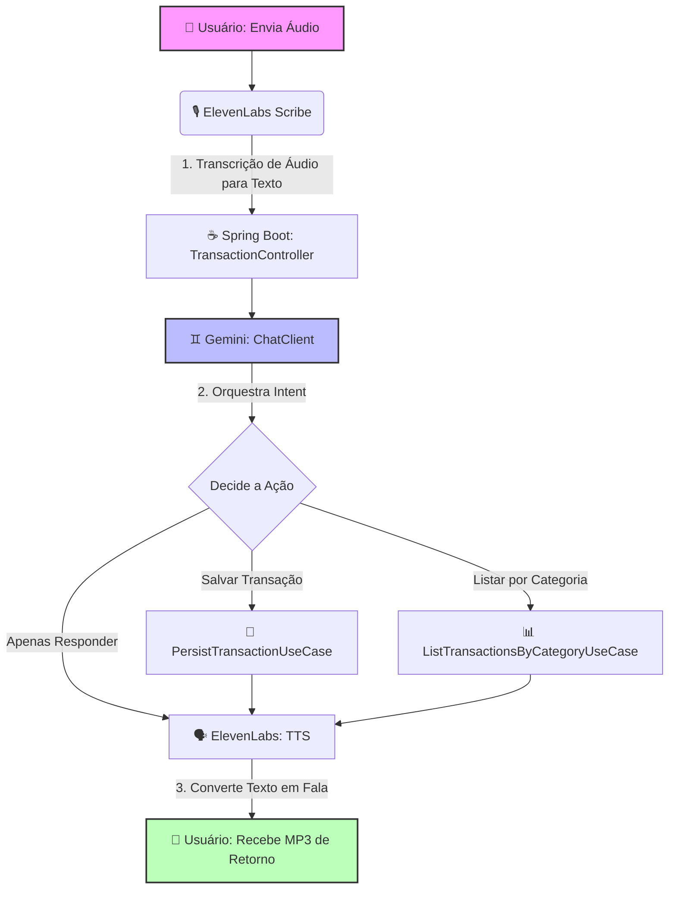

# 💰 Budgeting AI - Gestão Financeira Inteligente com IA

Este projeto é uma aplicação de gerenciamento financeiro que integra Inteligência Artificial para facilitar o controle de transações. Através dele, o usuário pode enviar um comando de voz descrevendo uma movimentação financeira, a aplicação transcreve o áudio, processa a intenção usando LLM (executando a persistência ou listagem de dados automaticamente via *Tools*) e devolve a resposta final também em formato de áudio.

O projeto foi desenvolvido como desafio prático integrando os **Bootcamps do Santander e Globant**.

---

## 🚀 Tecnologias Utilizadas

O ecossistema do projeto foi construído utilizando as seguintes tecnologias:

* **Java 21**
* **Spring Boot 3.3.0**
* **Spring AI** (Integração com ecossistema de Inteligência Artificial)
* **Spring Boot Docker Compose** (Gerenciamento automático do ambiente de banco de dados)
* **MySQL 9.6** (Persistência de dados)
* **Google AI Studio (Gemini)** (Processamento de linguagem natural e orquestração de Use Cases)
* **ElevenLabs** (Serviços de Speech-to-Text via modelo *Scribe* e Text-to-Speech)

---

## 🧠 Arquitetura do Fluxo de IA



---

## 📋 Pré-requisitos

Antes de iniciar o projeto, você precisará configurar as seguintes credenciais:

1.  **Google AI Studio:** Gere uma `API-KEY` para ter acesso ao modelo do **Gemini**.
2.  **ElevenLabs:** Crie uma conta e gere uma `API-KEY`. Como o plano gratuito restringe o uso de vozes da biblioteca via API (causando o erro HTTP 402), certifique-se de encontrar e mapear uma **ID de voz padrão gratuita** que ofereça suporte ao idioma português (PT).

---

## ⚙️ Configuração do Ambiente

Crie ou edite o seu arquivo `src/main/resources/application.properties` e adicione as suas chaves e configurações:

```properties
# Configurações do Banco de Dados (Gerenciado via Docker Compose)
spring.docker.compose.enabled=true

# Chave de API do Google AI Studio (Gemini)
spring.ai.openai.api-key=SUA_API_KEY_DO_GEMINI_AQUI

# Configurações do ElevenLabs
spring.ai.elevenlabs.api-key=SUA_API_KEY_DO_ELEVENLABS_AQUI
minha.voz.gratuita=ID_DA_SUA_VOZ_GRATUITA_PT
````

Nota de Implementação: Devido às limitações do plano gratuito da API do ElevenLabs, a aplicação possui uma classe de configuração customizada (ElevenLabsTranscriptionConfig) e injeção explícita de ElevenLabsTextToSpeechOptions no controlador para garantir que as requisições não sejam barradas pelo servidor.

---

## 🛠️ Como Executar o Projeto
Graças ao módulo spring-boot-docker-compose, você não precisa instalar ou configurar o MySQL localmente, contanto que tenha o Docker instalado e rodando em sua máquina.

Clone o repositório:
```
Bash
git clone [https://github.com/EliasOFreitas/dio-projeto-budgeting.git](https://github.com/EliasOFreitas/dio-projeto-budgeting.git)
cd seu-repositorio
```
Certifique-se de que o Docker Desktop ou o serviço do Docker esteja ativo.

Compile e execute a aplicação usando o Gradle:

```
Bash
./gradlew bootRun

```

O Spring Boot detectará o arquivo compose.yml, subirá o container do MySQL 9.6 de forma totalmente automatizada, criará as tabelas necessárias e inicializará o servidor Tomcat na porta 8080.

---

## 🛣️ Endpoints Principais
1. Processamento por Voz (IA)
Envia um comando de voz e recebe a resposta do sistema também em áudio (.mp3).

URL: POST /transactions/ai

Consumes: multipart/form-data

Produces: audio/mp3

Parâmetros (Body):

file: Arquivo de áudio (ex: .mp3, .wav, .m4a) contendo a frase (Ex: "Cadastre uma despesa de 50 reais em alimentação").

2. Criação Manual de Transação
URL: POST /transactions

Body (JSON):

JSON
{
  "description": "Assinatura de Streaming",
  "amount": 34.90,
  "type": "EXPENSE",
  "category": "ENTERTAINMENT"
}

3. Listagem por Categoria
URL: GET /transactions/{category}
* **Exemplo:** `GET /transactions/AUTO`
* **Response (JSON):**
    ```json
    [
      {
        "id": 1,
        "description": "Abastecimento do carro",
        "amount": 50.00,
        "category": "AUTO"
      }
    ]
    ```

---

## 🛠️ Detalhes de Implementação (Evitando o Erro 402 e Incompatibilidades)

Como o ecossistema do **Spring AI** é recente, este projeto traz soluções arquiteturais importantes para contornar limitações de APIs:
1. **Transcrição Customizada:** Usado o `ElevenLabsTranscriptionConfig` para implementar manualmente a interface `TranscriptionModel`, já que o Spring AI ainda não possui um auto-configurador nativo para o modelo *Scribe* da ElevenLabs.
2. **Blindagem de Opções:** O `TransactionController` injeta e força explicitamente as `ElevenLabsTextToSpeechOptions` em tempo de execução, garantindo que o ID da voz gratuita em português seja respeitado e prevenindo bloqueios de conta (*Premium Required - HTTP 402*).

---

## 👥 Créditos e Bootcamp

Projeto desenvolvido por **Elias Freitas** como critério de conclusão do desafio prático de IA nos bootcamps:
* **Santander 2026 AI Java Back-end**
* **Globant Java & Spring Boot AI Developer**

Sinta-se à vontade para dar um fork, clonar o repositório e testar suas próprias automações financeiras por voz! 🚀
